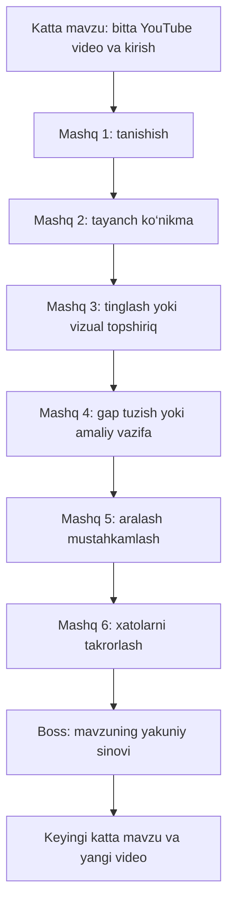

# Platformani rivojlantirish rejasi

Sana: 2026-yil 8-oktabr. Qamrov: foydalanuvchining 9 ta taklifini mavjud OYLA loyihasiga qo‘llash. Xato javob izohi (5-bo‘lim), boshlang‘ich avatarlar va brendni almashtirish mexanizmi (7-bo‘lim) mahalliy kodda amalga oshirildi. Qolgan bo‘limlar rivojlantirish rejasi bo‘lib qoladi.

Asosiy maqsad: bolalar uchun qiziqarli o‘quv yo‘li yaratish — katta mavzu boshida bitta YouTube video, keyin shu mavzuni turli usullarda mustahkamlaydigan ko‘plab qisqa mashg‘ulotlar, batafsil xato izohi va haqiqiy sovg‘aga almashtiriladigan XP.

## 1. Mavjud loyiha bo‘yicha aniqlangan holat

Quyidagi ma’lumotlar kod va repozitoriydagi katalogga tegishli. Ishlayotgan bazadagi kontent bu reja uchun tekshirilmagan.

| Yo‘nalish | Hozir mavjud | Kerakli o‘zgarish |
| --- | --- | --- |
| Mashq turlari | 18 ta tur, umumiy renderer, admin muharriri va oldindan ko‘rish | Interaktiv turlarni asosiy darslarga tarqatish, ularning ko‘rinishi va ishlash usulini boyitish |
| Kontent hajmi | Asosiy katalogda 54 dars × 6 savol; qo‘shimcha 9 interaktiv dars × 8 mashq | Har katta mavzuga bir nechta mashg‘ulot va kattaroq savollar banki |
| Ingliz tili | 5-, 6-, 7-sinf mavzulari farqli, lekin ko‘p javoblar bir so‘zli yoki variantli | Matn, kontekst, mustaqil gap tuzish va tinglash murakkabligini sinfga qarab oshirish |
| Dars oqimi | Har darsda “Tushuntirish → Misol → Mashq” | Video va kirishni katta mavzu darajasiga chiqarish; keyingi darslarni bevosita mashqdan boshlash |
| Darslar xaritasi | Vertikal yo‘l, joriy/yakunlangan/qulflangan holatlar, oldingi dars sharti | Video, mashq, takrorlash va yakuniy sinov tugunlari bilan boyroq xarita |
| Xato izohi | API `explanation` va `hint` qaytaradi; pastki panel umumiy izohni ko‘rsatadi | Aynan o‘quvchi qilgan xato, qoida, to‘g‘ri yechim va kichik misol |
| O‘yin rejimlari | Mini-game va boss-battle mavjud; bir xil savollar boshqacha progress bilan beriladi | Boss uchun alohida yakuniy savollar, mazmunli mini-o‘yin mexanikasi |
| XP | Server hisoblaydi; takroriy mukofotdan himoya mavjud | Sovg‘alar katalogi, sarflanadigan qoldiq, buyurtma va topshirish jarayoni |
| Profil va brend | Ism bosh harflari bilan avatar, bir nechta joyda OYLA nomi | Avatar tanlash; nom, logo va ranglarni markaziy konfiguratsiyadan boshqarish |

Demak, mavjud mashq mexanizmlarini kengaytirish va o‘quv kontentini qayta tashkil qilish asosiy ish bo‘ladi.

## 2. Katta mavzuning yangi tuzilishi

Mavjud `Course → Topic → Lesson → Question` tuzilmasi saqlanadi. `Topic` katta mavzu, `Lesson` esa xaritadagi qisqa mashg‘ulot bo‘ladi. Bir-biriga yaqin kichik mavzular o‘quv maqsadi asosida bitta katta mavzuga birlashtiriladi.



- Boshlang‘ich shablon: **1 video + 6 mashg‘ulot + 1 yakuniy sinov**. Fan va mavzu hajmiga qarab mashg‘ulotlar soni oshiriladi.
- Oddiy mashg‘ulotda 8–10 topshiriq, yakuniy sinovda 10–12 topshiriq: bir katta mavzuda 58–72 ta yechish qadami. Takrorlash bosqichi avvalgi xatolarni qayta ishlatishi mumkin.
- Har katta mavzu uchun dastlab 60–80 ta tekshirilgan, turli shakldagi savoldan iborat bank tayyorlanadi. Sonlar boshlang‘ich maqsad bo‘lib, bolalar bilan sinov natijasida sozlanadi.
- Mashg‘ulotlar taxminan 5–8 daqiqalik bo‘lishi ko‘zda tutiladi. Video ortidan hamma mashqni bir o‘tirishda bajarish talab qilinmaydi; bola keyin shu joydan davom ettiradi.
- Shu katta mavzu ichida navbatdagi mashg‘ulotga kirish to‘g‘ridan to‘g‘ri mashqlarni ochadi. Orada yangi video yoki alohida tushuntirish/misol sahifasi chiqmaydi.
- Mashqdan keyingi xato izohi va zarur ishora saqlanadi. Mavzu videosini xaritadagi kirish tugunidan ixtiyoriy qayta ko‘rish mumkin.
- Yangi tushuncha faqat kirish videosi yoki undagi qisqa kirishda qamrab olingan bo‘lsa shu mavzu mashqlariga kiritiladi.
- Ketma-ketlik serverda tekshiriladi. Yakunlanganlik va o‘zlashtirish alohida ko‘rsatiladi; keyingi mavzuni ochish chegarasi admin sozlaydigan yakuniy sinov natijasiga bog‘lanadi, boshlang‘ich taklif 70%.
- Takrorlashda mashqlar qo‘shimcha XP berishni o‘z-o‘zidan boshlamaydi. Hozirgi birinchi javob bilan baholash qoidasi saqlanadi; keyingi urinishlar o‘rganish uchun xizmat qiladi.

YouTube uchun:

- Har katta mavzuda almashtiriladigan `videoId` bo‘ladi. Dastlab foydalanuvchi ruxsatiga ko‘ra vaqtinchalik, bolalarga mos va embed orqali ochiladigan video qo‘yiladi; admin keyin havolani o‘zgartiradi.
- Video foydalanuvchi bosganda ijro etiladi. Mobil o‘lcham, to‘liq ekran, yuklanish va ochilmaslik holatlari ishlanadi.
- Dastlab “Ko‘rdim, mashqlarni boshlash” tugmasi kirish yakunlanganini serverga saqlaydi. Bu tasdiq to‘liq video ko‘rilganining isboti sifatida talqin qilinmaydi.
- Oxirigacha yetishni kuzatish kerak bo‘lsa, keyingi bosqichda IFrame Player API hodisalari qo‘shiladi. Video ochilmasa, YouTube’da ochish va administrator belgilagan muqobil kirish orqali davom etish mavjud bo‘ladi.
- Videoni almashtirish avvalgi o‘quv progressini avtomatik o‘chirmaydi. Vaqtinchalik video bilan real o‘quv maqsadiga mos yakuniy video alohida belgilab boriladi.

## 3. Mashqlar xilma-xilligi

Bir mavzuda imkon qadar 6–8 xil o‘zaro ta’sir usuli qo‘llanadi. Oddiy 8–10 topshiriqli mashg‘ulotda odatda kamida 3 xil usul bo‘ladi; ketma-ket bir xil usul ikki martadan ortiq takrorlanmaydi. Maxsus tinglash/nutq mashg‘ulotlari bundan mustasno. Osondan mustaqil javobga o‘tish mashq tanlash qoidalariga kiritiladi.

| Mashq | Ingliz tilidagi qo‘llanish | Mavjud mexanizm / qo‘shimcha ish |
| --- | --- | --- |
| Juftlik topish | So‘z–ma’no, gap–vaziyat, so‘z–rasm | `MATCH_PAIRS`; rasm va audio kartalarini kengaytirish |
| So‘zlardan gap yig‘ish | Aralashtirilgan so‘zlardan gap tuzish | `SORT_ORDER`; so‘z banki va gap satri ko‘rinishini qo‘shish |
| Sudrab joylashtirish | So‘zlarni kategoriyaga yoki gapdagi joyga qo‘yish | `DRAG_DROP`; bir kategoriyaga bir nechta so‘z qo‘yish uchun javob formatini kengaytirish |
| Tinglab bajarish | Eshitilgan gapni yig‘ish, mos rasmni topish | `LISTEN_ANSWER`; yozishdan tashqari so‘z banki/rasm javobi |
| Rasmda topish | Buyum, joy, yo‘nalishni belgilash | `INTERACTIVE_IMAGE`; mavzuga mos illustratsiyalar |
| Xatoni topib tuzatish | Noto‘g‘ri so‘z yoki fe’lni aniqlash va almashtirish | `FIND_MISTAKE`; aniqlashdan keyingi tuzatish bosqichi |
| Bo‘shliqni to‘ldirish | Bir yoki bir nechta gapdagi tushib qolgan so‘z | `FILL_GAP`; dastlab yordamchi bank, keyin mustaqil yozish |
| Xotira kartalari | So‘z–ma’no/rasm/audio juftliklari | `MEMORY_CARDS`; yopiq karta va topilgan juftlik animatsiyasi |
| Dialogni davom ettirish | Vaziyatga mos javobni tanlash yoki gap yig‘ish | Yangi dialog taqdimoti; mavjud baholash usullarini qayta ishlatish |
| Nutq mashqi | Gapni aytish, yozuvni tinglab tekshirish | `SPEAK`; mavjud yozib olish va matn asosidagi tekshiruv |
| Qisqa hikoya | Matndan ma’no, ketma-ketlik, sababni topish | Yangi passage/story taqdimoti; bir nechta bog‘langan savol |

Nutq bo‘yicha mavjud cheklov hisobga olinadi: hozir tizim tanilgan/kiritilgan matnni tekshiradi. Akustik talaffuz sifati baholanadi deb ko‘rsatilmaydi. Mikrofon yoki nutq tanish ishlamasa matnli muqobil yo‘l bo‘ladi.

Matematikada: kasrlarni rasmda moslash, son chizig‘iga joylash, yechim bosqichlarini tartiblash, xato bosqichni topish, geometrik obyektni belgilash. Informatikada: algoritm bloklarini tartiblash, qurilma–vazifa juftliklari, kod bo‘shliqlari va debugging. Fanlar uchun o‘quv maqsadiga mos mexanizm tanlanadi.

Mini-o‘yinlar to‘g‘ri javob bilan aniq harakatni bog‘laydi: juftlik topilganda karta ochiladi, algoritm yig‘ilganda yo‘l tugallanadi. Boss bosqichi mavzuni umumlashtiradigan alohida savollar to‘plamiga ega bo‘ladi. Bir xil savollarga boshqa bezak qo‘yish xilma-xillikning o‘rnini bosa olmaydi.

## 4. Ingliz tilini sinflar bo‘yicha sezilarli farqlash

Bu boshlang‘ich kontent mezonlari. Yakuniy ketma-ketlik markaz foydalanadigan darslik/dastur bilan solishtiriladi; to‘liq amaldagi maktab dasturiga moslik hozircha tasdiqlanmagan.

| Mezon | 5-sinf | 6-sinf | 7-sinf |
| --- | --- | --- | --- |
| Mavzu va qoida | Olmosh, to be, egalik, ko‘plik, Present Simple | Past Simple, Present Continuous, miqdor, qiyoslash, reja | Present Perfect/Past Simple farqi, Past Continuous, conditional, relative clauses |
| Vaziyat | Oila, maktab, buyum, kun tartibi | Sayohat, kechagi voqea, reja, yo‘nalish | Tajriba, voqealar bog‘lanishi, sabab va xulosa |
| Gaplar | Qisqa va bitta fikr | Uzunroq gap va qisqa dialog | Bog‘langan gaplar va mazmunli dialog |
| O‘qish | Taxminan 30–50 so‘zli matn | Taxminan 60–90 so‘zli matn | Taxminan 100–150 so‘zli matn |
| Tayanch | Ko‘proq rasm, so‘z banki va ko‘rsatma | Tayanch asta kamayadi | Ko‘proq mustaqil tuzish, taqqoslash va tahrirlash |
| Yakuniy vazifa | Oddiy gaplarni to‘g‘ri tuzish | Vaziyatni 2–3 gap bilan ifodalash | Matn/voqeadan xulosa chiqarish, zamon tanlash va xatoni tuzatish |

Mavjud 7-sinfda murakkab grammatika bor, lekin “She ___ finished…” kabi bir so‘zli javob mashq darajasini sodda ko‘rsatadi. Yangi kontentda bolaning kontekstni tushunishi va qoidani qo‘llashi ham tekshiriladi.

Har savolga sinf, ko‘nikma (`skillKey`), murakkablik va topshiriq maqsadi biriktiriladi. Bir xil savolni faqat boshqa sinf nomi bilan ko‘rsatish kontent tekshiruvida rad etiladi. Erkin matn vazifalari MVPda oldindan tekshirilgan javoblar/shakllar bilan chegaralanadi; keng, ochiq yozuvni ishonchli baholash alohida ish sifatida ko‘riladi.

## 5. Xato javobdan keyingi tushuntirish

Mashq ostidagi panel quyidagi tartibda ishlaydi:

1. **Sizning javobingiz** — bola nimani tanlagani yoki tuzgani.
2. **Nima uchun xato?** — aynan shu xatoning sababi, odatda 1–3 sodda jumla.
3. **Qoida** — tegishli qoida yoki hisoblash bosqichi.
4. **To‘g‘ri yechim va misol** — tuzatilgan javob, farqli kichik misol.
5. **Yana urinib ko‘rish / Davom etish** — o‘quvchi tanlaydi; uzunroq izoh zarur bo‘lsa ochiladi.

Misol: `She go to school every day.`

> “She” uchinchi shaxs birlik bo‘lgani uchun Present Simple’da “go” o‘rniga “goes” ishlatiladi. To‘g‘ri gap: “She goes to school every day.” Yana bir misol: “He goes home at five.”

Variantli savollarda noto‘g‘ri variantga tegishli sabab saqlanadi. Gap yig‘ishda noto‘g‘ri tartib, juftlashda mos kelmagan juftlik, matematikada noto‘g‘ri bosqich ko‘rsatiladi. Sababni aniq ajratib bo‘lmasa, taxminiy tashxis o‘rniga tekshirilgan umumiy yechim chiqadi.

Admin muharririga qoida, yechim qadamlari, qo‘shimcha misol va noto‘g‘ri javob izohlari qo‘shiladi. Ular urinishning mavjud immutable snapshotiga kiritiladi; javob kalitlari javob yuborilishidan oldin o‘quvchiga berilmaydi. Izoh qayta kirganda ham tiklanadi. Mazmun tekshirilgan kontentdan olinadi.

## 6. Shop va real sovg‘alar

**Foydalanuvchi tasdiqlagan model:** sovg‘alarni administrator yoki o‘quv markazi tasdiqlaydi va topshiradi.

O‘quvchi uchun `/shop`:

- Sovg‘a rasmi, nomi, tavsifi, XP narxi, mavjud soni va olish sharti.
- “Shop uchun XP” qoldig‘i va kerakli sovg‘aga qancha XP yetmayotgani.
- Almashtirishni tasdiqlash oynasi va “Mening buyurtmalarim”.
- Buyurtma holati: kutilmoqda → tasdiqlandi → topshirildi; bekor qilish/rad etish sababi ham ko‘rinadi.
- Boshlang‘ich sovg‘a misollari: daftar, ruchka, kitob, markaz merch’i. Haqiqiy mahsulotlar, narxlar va zaxira markaz tomonidan kiritiladi.

XP modeli:

```text
Jami XP = o‘qish orqali tarixan qo‘lga kiritilgan XP
Shop uchun XP = jami XP − sarflangan yoki buyurtmaga band qilingan XP
```

Boshlang‘ich taklif: 1 olingan XP = 1 sarflanadigan XP. Shopdan sovg‘a olish jami XP, daraja va reytingni pasaytirmaydi. Sarflar uchun alohida ledger ishlatiladi; mavjud o‘quv XP ledgeriga manfiy sovg‘a operatsiyalari qo‘shilmaydi. Avval yig‘ilgan XP ham, boshqa sarf yo‘qligi sababli, boshlang‘ich qoldiqda hisoblanadi.

Buyurtma yaratilganda XP va mahsulot zaxirasi bitta tranzaksiyada band qilinadi. Tasdiqlashda ikkinchi marta yechilmaydi. Topshirilganda band qilingan XP sarflangan deb yakunlanadi. Topshirilmagan buyurtma bekor/rad qilinsa XP va zaxira faqat bir marta qaytariladi. Topshirilgan sovg‘a uchun avtomatik qaytarish ishlamaydi.

Admin uchun `/admin/shop`:

- Mahsulot, XP narxi, zaxira, ko‘rinish va olish shartlarini boshqarish.
- Buyurtmalarni ko‘rish, tasdiqlash, rad qilish, topshirilganini belgilash va qayd yozish.
- Topshirish joyi va tartibini ko‘rsatish; MVPda markazda olib ketish oqimi.
- Har amal kim tomonidan, qachon va qanday bajarilgani tarixi.

Narx va qoldiq serverda hisoblanadi. Takroriy so‘rovga bir xil buyurtma qaytariladi; parallel buyurtmalar qoldiq yoki zaxirani manfiy qilolmaydi. Narx va sovg‘a nomi buyurtma yaratilgandagi holatda saqlanadi. Mahsulotni keyin tahrirlash avvalgi buyurtmani o‘zgartirmaydi.

Real sovg‘a narxlari mavjud XP qoidalari va yangi darslar soni asosida hisoblanadi. Katalog kengayganda barcha yangi darslarga eski mukofotni ko‘paytirib berish sovg‘a iqtisodini keskin o‘zgartirishi mumkin; shu sabab XP balansi kontent bilan birga qayta tekshiriladi. Tugmani qayta bosish, video ko‘rish yoki bitta darsni cheksiz takrorlash mukofot manbai bo‘lmaydi.

## 7. Avatar, nom va logo

- Profilga 12 ta boshlang‘ich avatar, tanlash oynasi, ko‘rib chiqish va saqlash qo‘shiladi. Tanlov serverda saqlanib, boshqa qurilmada ham tiklanadi.
- Avatar profil, yuqori menyu, do‘stlar, sinfdoshlar va reytingda bir xil chiqadi.
- Keyingi bosqichda ayrim avatarlar nishon yoki katta mavzuni yakunlash orqali ochilishi mumkin. Boshlang‘ich avatar tanlash bepul.
- Admin tekshirilgan avatar katalogini boshqaradi; foydalanuvchi tanlash uchun `avatarId` yuboradi.
- Nom, logo, qisqa shior va asosiy ranglar markaziy `brand` konfiguratsiyasiga chiqariladi.
- Foydalanuvchi yuboradigan nom/logo kirish sahifasi, menyu, brauzer sarlavhasi, favicon va mahsulot matnlariga qo‘llanadi. Mos o‘lcham va fon variantlari tayyorlanadi.
- Nom va logo kelguncha ularni almashtirish mexanizmi hamda sahifalarning yangi tuzilishi ustida ishlash mumkin. Yakuniy brend aktivlari keyin kiritiladi.

## 8. Bolalar uchun dizayn va namunalarni qo‘llash

Asosiy yo‘nalish: rangli mavzu hududlari, katta dumaloq bosqichlar, sezilarli bosish holatiga ega tugmalar, mavzuga mos rasmlar, qahramon orqali dalda va qisqa muvaffaqiyat animatsiyalari.

| Sahifa | Yangi ko‘rinish va xatti-harakat |
| --- | --- |
| Bosh sahifa | “Davom etish” asosiy harakati, joriy mavzu, kunlik maqsad, yaqin sovg‘aga progress |
| Fan / darslar xaritasi | Burilib boruvchi yo‘l, rangli mavzu sarlavhasi, video/mashq/takrorlash/boss belgilari |
| Mashq | Bitta vazifa markazda, katta javob elementlari, yuqorida progress, pastda Tekshirish va javob izohi |
| Natija | Qisqa tabrik, XP, o‘zlashtirish, keyingi bosqich va sovg‘aga yaqinlashish |
| Shop | Sovg‘alar vitrinasiga o‘xshash kartalar, XP narxi va olish jarayoni |
| Profil | Tanlangan avatar, yutuqlar va avatar tanlash |

O‘quvchi interfeysi o‘yin xarakteriga ega bo‘ladi. Admin va o‘qituvchi ekranlarida boshqarish hamda ma’lumot o‘qish qulayligi ustuvor turadi. Bitta vazifani bajarayotganda keraksiz harakatlanuvchi elementlar chalg‘itmaydi.

Qo‘llash mezonlari:

- Mobil ekranda xarita va mashqlar to‘liq ishlashi; 360 px kenglikda gorizontal toshib ketish bo‘lmasligi.
- Asosiy bosiladigan elementlar kamida 44 × 44 px; sudrash bilan birga bosish/klaviatura yo‘li.
- To‘g‘ri/xato holatlari rang bilan birga belgi va matn orqali ham anglashilishi.
- Ovoz effektlarini o‘chirish, kamaytirilgan animatsiya sozlamasini hurmat qilish va yengil aktivlar.
- Xarita tuguni bosilganda nomi, holati va boshlash/davom ettirish harakati ko‘rinishi.

Duolingo’dan olinadigan asoslar: bosqichli yo‘l, qisqa mashg‘ulotlar, yo‘l ichidagi takrorlash, tinglash/o‘qish/yozish/nutq aralashmasi va darhol javob. Bizning bir-video-per-mavzu oqimimiz alohida mahsulot qarori bo‘ladi. Duolingo bu kabi yo‘l va aralash ko‘nikmalarni o‘zining [rasmiy tavsifida](https://blog.duolingo.com/duolingo-101-how-to-learn-a-language-on-duolingo/) tushuntiradi.

Foydalanuvchi yuboradigan dizayn va g‘oyalar uchun alohida moslashtirish jadvali tuziladi: **namuna → olinadigan g‘oya → loyihadagi sahifa/mashq → texnik yechim → tayyorlik mezoni**. Namunalar hali kelmagan; ularning tafsilotlari bu rejada taxmin qilib tasdiqlanmagan. Ular kelgach xarita, mashq va natija maketlari birinchi bo‘lib moslashtiriladi; loyiha uchun o‘z logo/qahramon/aktivlari ishlatiladi.

## 9. Texnik ishlar xaritasi

Quyidagi nomlar taklif qilinayotgan sxema; yakuniy kod yozishda aniqlashtiriladi.

| Qatlam | Asosiy o‘zgarish | Mavjud joy / yangi modul |
| --- | --- | --- |
| Kontent modeli | `Topic`ga video, kirish matni, kirish versiyasi va yangi oqim rejimi; `Lesson`ga PRACTICE/REVIEW/BOSS turi | `apps/api/prisma/schema.prisma` |
| Kirish progressi | `TopicIntroProgress`: foydalanuvchi, mavzu, tasdiqlangan kirish versiyasi va vaqt | Yangi model, learning API |
| Kontent API | Mavzu kirishini olish/tasdiqlash; grade/publishing va serverdagi kirish shartlari | `apps/api/src/learning/`, `apps/api/src/progress/` |
| Mashq va feedback | Ko‘nikma belgisi, media taqdimoti, xatoga mos izoh; definition/snapshot versiyalari | `apps/api/src/learning/exercises.ts`, `exercise.dto.ts`, `learning.service.ts` |
| Takrorlash | Xato/ko‘nikmaga asoslangan saralash; review, lesson va daily urinishini aniq ajratish | `Attempt.kind` va learning/progress; hozir `lessonId` yo‘q urinish daily sifatida ishlaydi |
| O‘quvchi interfeysi | Mavzu video sahifasi, boyitilgan xarita, bevosita mashq oqimi | `apps/web/src/pages/lesson.tsx`, `components/lesson-path.tsx`, `components/exercises/` |
| Admin kontent | Video havolasi, kirish, tugun turi, savol/feedback muharriri va preview | `apps/web/src/pages/admin/content.tsx`, `components/exercises/question-editor.tsx`, API admin DTOlari |
| Shop | `RewardItem`, `Redemption`, sarf/band qilish ledgeri va amal tarixi | Yangi `apps/api/src/shop/`, `/shop`, `/admin/shop` sahifalari |
| Avatar | `User.avatarId`, avatar katalogi, barcha ro‘yxatlarda umumiy avatar komponenti | `apps/api/src/profile/`, `pages/profile.tsx`, `components/ui/avatar.tsx` |
| Brend/dizayn | Markaziy brand config, rang/tugma tokenlari, aktivlar | `components/shell.tsx`, `styles.css`, `styles/exercises.css`, `apps/web/index.html` |
| Kontent yuklash | Katta mavzular va yangi darslarni versiyalangan, takror bajarish xavfsiz import qilish | `apps/api/prisma/curriculum/`, interaktiv kontent loaderi |
| Hisobot | Yangi savol turlari, ko‘nikmalar va review urinishlarining hisobga olinishi | `apps/api/src/teacher/`, `apps/api/src/progress/` |

Review urinishlari alohida XP imkoniyatiga aylanmaydi va mavzu mastery hisobiga tasodifan qo‘shimcha vazn qo‘shmaydi. Yangi API/DTOlar mijozdan score, XP, buyurtma narxi yoki boshqa foydalanuvchi identifikatorini ishonchli qiymat sifatida qabul qilmaydi.

Migratsiya tartibi: avval qo‘shimcha maydonlar va eski/yangi oqimni ajratish, keyin yangi mavzularni bosqichma-bosqich qo‘shish. Eski urinish snapshotlari, assignment havolalari, XP, best score va admin tahrirlari saqlanadi. Oldingi darslarni bajargan bolalar yangi kirish talabi sabab birdan bloklanmaydi; mos progress uchun kirish holati xavfsiz to‘ldiriladi. Eski kontent faqat ma’lumot/havola saqlanishi tekshirilgach arxivlanadi.

## 10. Amalga oshirish ketma-ketligi

| Bosqich | Natija | Bog‘liqlik |
| --- | --- | --- |
| 1. Kontent va maket | 5/6/7-sinf uchun katta mavzular xaritasi, mashq matritsasi; xarita, mashq, feedback va Shop maketlari | Mavjud kod; yakuniy vizual moslashtirish uchun yuboriladigan namunalar |
| 2. Video va mavzu oqimi | Mavzu boshida video, serverda kirish progressi, keyingi tugunlarda bevosita mashq, resume | 1-bosqichdagi mavzu modeli |
| 3. Ingliz tili piloti | Har sinf uchun bittadan to‘liq katta mavzu, aralash mashqlar, kengroq xato izohlari, yakuniy sinov | 2-bosqich va tekshirilgan savollar banki |
| 4. Dizayn va avatar | Rangli xarita, yangi mashq/natija ekrani, boshlang‘ich 12 avatar, umumiy brend konfiguratsiyasi | 1-bosqich maketlari; yakuniy logo/nom kelganda aktivlar |
| 5. Shop | Real sovg‘alar katalogi, sarflanadigan XP, buyurtma, admin tasdiqlashi va topshirishi | XP iqtisodi, mahsulot/zaxira/olish shartlari |
| 6. Kengaytirish va tekshirish | Matematika/informatikada sinflar bo‘yicha pilotlar, keyin qolgan katta mavzular; mobil va integratsion tekshiruv | Ingliz tili pilotidan olingan natija va kontent tayyorligi |

Dizayn maketlari birinchi bosqichdayoq tayyorlanadi; umumiy dizayn ishlab chiqilishi mavzu/mashq oqimi bilan birga boshlanishi mumkin. Shop tayyor bo‘lishi o‘quv pilotini sinashni kechiktirmaydi.

Birinchi to‘liq namuna: **5-sinf — “Mening kundalik hayotim”**. Unda 1 video, 6 mashg‘ulot, 1 boss, 60–80 savollik bank, kamida 6 mashq usuli va har xato uchun tushuntirish bo‘ladi. So‘ng 6-sinfda “O‘tgan voqealar”, 7-sinfda “Tajriba va natija” namunasi ishlab chiqilib, farqi yonma-yon ko‘riladi.

Uchta ingliz tili piloti 180–240 ta bank savolini talab qiladi. Uch fan va uch sinfdan bittadan katta mavzu tayyorlash 540–720 ta bank savoli hajmiga yetadi. Shuning uchun kontent yozish, audio/rasm tayyorlash va pedagogik tekshiruv alohida ish hajmi sifatida yuritiladi. Barcha eski darsni avtomatik ko‘paytirish bilan sifatli kontent hosil bo‘lmaydi.

Aniq muddat pilotdagi kontent, namunalar va aktivlar hajmi aniqlangach belgilanadi. Har bosqich tugashi tekshiriladigan natija bilan o‘lchanadi.

## 11. Tayyorlik mezonlari

- Katta mavzu bir marta kirish videosi bilan boshlanadi; qolgan tugunlar orasida yangi video yoki alohida tushuntirish sahifasi chiqmaydi. Qayta kirish progressni tiklaydi.
- Pilot mavzular son va xilma-xillik maqsadlariga javob beradi; ularning barcha javob kaliti va izohlari mustaqil mazmuniy tekshiruvdan o‘tadi.
- 5- va 7-sinf ingliz tili matn, yordam, qoida va topshiriq talabi bilan farqlanadi; grade filtering serverda ishlaydi.
- Xato javob izohida sabab, qoida va to‘g‘ri yechim ko‘rinadi. Qayta kirilganda feedback tiklanadi; bosish/klaviatura/telefon orqali mashqlar bajariladi.
- Shop buyurtmasi takrorlanmaydi; parallel so‘rov, yetarli XP yo‘qligi, zaxira tugashi, narx tahriri, rad etish va qaytarish holatlari tekshiriladi. Shopdagi sarf reyting/darajani kamaytirmaydi.
- Avatar tanlovi qayta login va boshqa sahifalarda saqlanadi; katalogda yo‘q avatar server tomonidan rad etiladi.
- Eski progress, urinish, XP va topshiriq havolalari saqlanadi; yangi oqimga o‘tish ularni bloklamaydi.
- O‘zgargan joylarga mos backend/frontend testlar va real brauzer ssenariylari bajariladi. Release oldidan loyihaning lint, typecheck, unit, build, browser va xavfsiz mahalliy integratsion tekshiruvlari o‘tkaziladi.
- Pilotni 5/6/7-sinf vakillari bilan sinab, qayerda to‘xtab qolish, mashg‘ulotni tugatish, xatodan keyingi muvaffaqiyat va keyingi bosqichga qaytish kuzatiladi. Boshlang‘ich ko‘rsatkichlar bilan taqqoslanmaguncha qiziqarlilik oshgani raqam bilan da’vo qilinmaydi.

## 12. Aniqlashtiriladigan materiallar

Nom/logo va namunaviy dizaynlar foydalanuvchi tomonidan keyin yuboriladi. Markaz kiritadigan sovg‘alar ro‘yxati, zaxira, olish joyi hamda foydalaniladigan ingliz tili darsligi/dasturi yakuniy kontent va Shop sozlamalarini aniqlaydi. Bu materiallar kelguncha texnik tuzilma, mavjud mashqlarni kengaytirish va pilot maketlar tayyorlanishi mumkin.

YouTube integratsiyasi [rasmiy IFrame Player API](https://developers.google.com/youtube/iframe_api_reference) va [player parametrlari](https://developers.google.com/youtube/player_parameters) asosida quriladi. Yo‘l ichidagi takrorlash uchun Duolingo’ning [yo‘l dizayni izohi](https://blog.duolingo.com/new-duolingo-home-screen-design/) mahsulot ma’lumotnomasi sifatida ishlatiladi.
